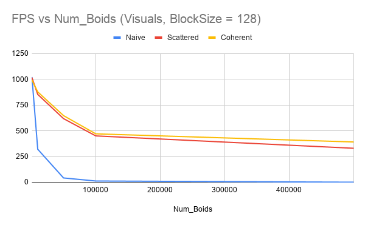
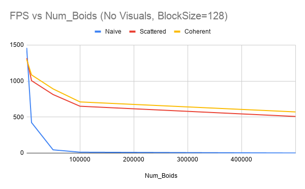
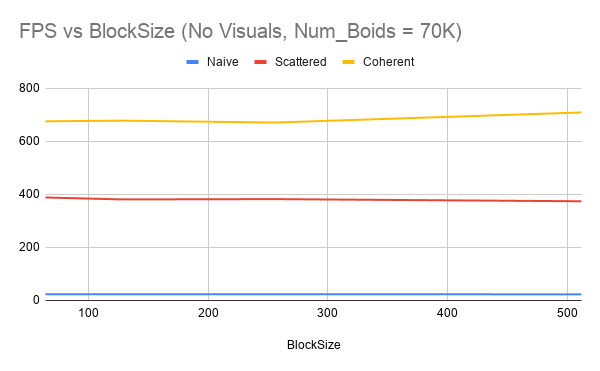

Project 1 - Flocking
====================
**University of Pennsylvania, CIS 565: GPU Programming and Architecture**

Dhruv Karthik: [LinkedIn](https://www.linkedin.com/in/dhruv_karthik/)

Tested on: Windows 10 Home, Intel(R) Core(TM) i7-8700 CPU @ 3.20GHz, 16GM, GTX 2070 - Compute Capability 7.5
____________________________________________________________________________________
   
____________________________________________________________________________________

| 10,000 Boids | 70,000 Boids |
| ------------- | ----------- |
|   |  |

# Runtime Analysis

# Questions
**For each implementation, how does changing the number of boids affect performance? Why do you think this is?**
On average, more boids decreased the performance. 
1. *Naive*: More boids directly increases the iters of the for loop that iterates over all the boids, thereby increasing runtime
2. *Scattered & Coherent*: While better than the Naive algorithm, both of these algorithms would suffer if several boids were clustered together. High boid density in certain cells would increase the runtime of the for loop iterating over all boids. 

**For each implementation, how does changing the block count and block size affect performance? Why do you think this is?**
Negligible, and uncorellated. However, the coherent grid consistently performed twice as well as the scattered grid. 

**For the coherent uniform grid: did you experience any performance improvements with the more coherent uniform grid? Was this the outcome you expected? Why or why not?**
I expected performance improvements, but not to this level. I was surpised by the fact that merely not indexing into another array could provide (on occasion) almost double the runtime. 
