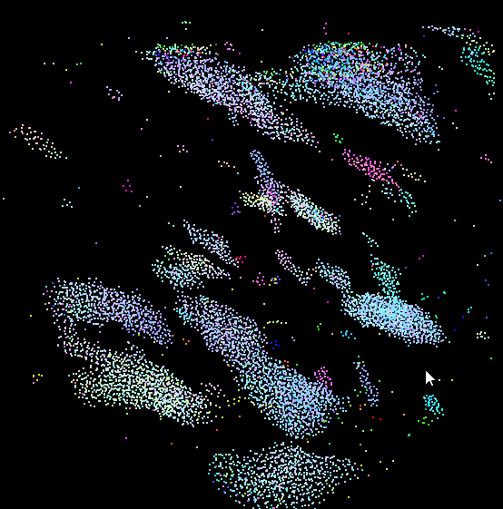
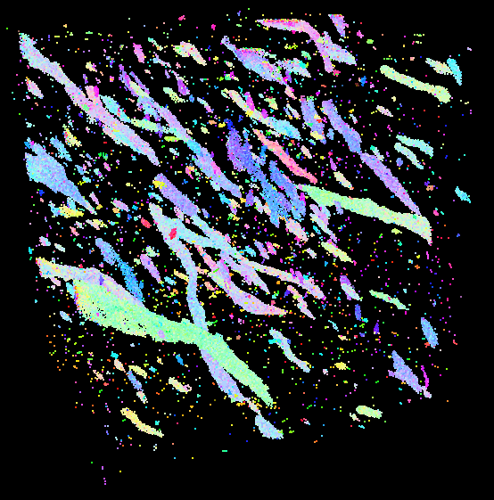
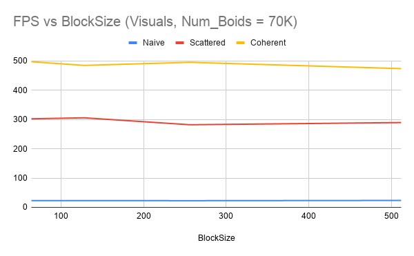

Project 1 - Flocking
====================
**University of Pennsylvania, CIS 565: GPU Programming and Architecture**

Dhruv Karthik: [LinkedIn](https://www.linkedin.com/in/dhruv_karthik/)

Tested on: Windows 10 Home, Intel(R) Core(TM) i7-8700 CPU @ 3.20GHz, 16GM, GTX 2070 - Compute Capability 7.5
____________________________________________________________________________________
   
____________________________________________________________________________________

| 10,000 Boids | 70,000 Boids |
| ------------- | ----------- |
|   |  |

# Runtime Analysis

